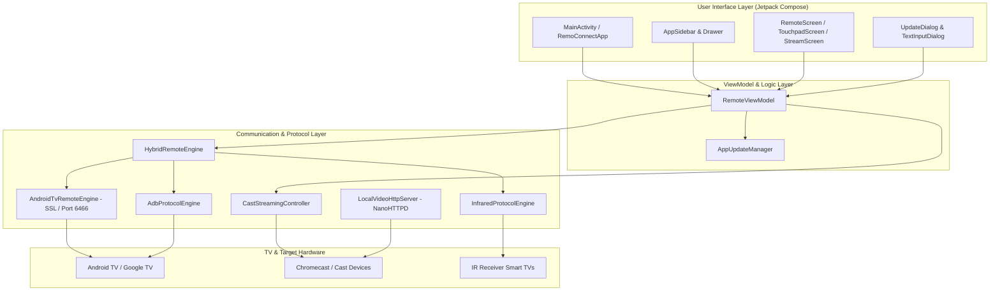

# RemoConnect 📺📱

[](https://developer.android.com)
[](https://kotlinlang.org)
[](https://developer.android.com/jetpack/compose)
[](LICENSE)
[]()

**RemoConnect** is a modern, high-performance Android remote control application for Smart TVs, Android TV, and Google TV devices. Built with **Kotlin**, **Jetpack Compose (Material 3)**, and **Coroutines**, RemoConnect provides seamless TV navigation, touch gesture control, media streaming, application shortcuts, and an integrated in-app updater.

---

## 🌟 Key Features

| Feature | Description |
| :--- | :--- |
| 🎛️ **Full Remote Control** | D-Pad navigation, Volume/Mute control, Power, Home, Back, Input Source selection, and playback controls. |
| 🖱️ **Trackpad & Gestures** | Smooth touch navigation, multi-directional swipe gestures, and tap-to-select functionality. |
| 📺 **Stream & Screen Cast** | Google Cast framework integration & local HTTP video server streaming powered by NanoHTTPD. |
| 🚀 **App Quick Launchers** | Instant launch shortcuts for Netflix, YouTube, Prime Video, Disney+, Spotify, and custom Android TV apps. |
| 🔄 **In-App Updater** | Automated update engine checking release endpoints, downloading updates with progress tracking, and launching APK installation. |
| 🎨 **Material 3 UI & Navigation** | Slide-out navigation drawer (sidebar) alongside quick-access bottom navigation. |

---

## 🏗️ System Architecture



---

## 📺 Supported Devices & Protocols

RemoConnect automatically discovers and pairs with a wide range of smart devices across home networks:

### 1. **Android TV & Google TV (TLS/SSL Pairing)**
- **Supported Models**: Sony BRAVIA, TCL Android TV, Hisense Smart TV, Philips Android TV, Xiaomi Mi Box / TV Stick, Nvidia Shield TV, Chromecast with Google TV.
- **Protocol**: Android TV Remote Control Protocol v2 (`Port 6466` for controls, `Port 6467` for TLS PIN pairing).

### 2. **Cast & Streaming Devices**
- **Supported Models**: Google Chromecast (1st, 2nd, 3rd Gen, Ultra), Chromecast built-in TVs, Vizio SmartCast TVs.
- **Protocol**: Google Cast Framework + Local NanoHTTPD HTTP Video Streaming Server.

### 3. **Developer & ADB Controlled TVs**
- **Supported Models**: Android TV devices operating in network debugging mode.
- **Protocol**: TCP / ADB Shell Commands.

### 4. **Legacy Infrared (IR) TVs**
- **Supported Models**: Televisions with IR receivers (Samsung, LG, Panasonic, Sharp, Toshiba, Sony).
- **Hardware Requirement**: Android smartphone equipped with a built-in Consumer IR (Infrared Blaster) hardware sensor.

---

## 🚀 Getting Started

### Prerequisites
- Android device running **Android 7.0 (API level 24)** or higher.
- Smart TV connected to the same Wi-Fi network (or smartphone with IR blaster for infrared control).

### Step-by-Step Connection Guide

1. **Launch & Scan**: Open RemoConnect and navigate to the **TVs** tab. The app automatically scans your local Wi-Fi network using mDNS discovery.
2. **Select Your TV**: Tap on your discovered TV name (e.g. `Living Room Android TV`).
3. **PIN Pairing**:
   - If connecting for the first time via Android TV protocol, a 4-digit code will appear on your TV screen.
   - Enter the code in the RemoConnect pairing dialog and tap **Submit**.
4. **Control & Enjoy**: Once paired, your device stays saved for instant automatic reconnection.

---

## 🔄 In-App Updater

RemoConnect features a complete self-contained update manager:

- **Automatic Check**: Connects to the release endpoint (GitHub API / Custom JSON server) to check for newer `versionCode` builds.
- **Download Progress**: Downloads `.apk` updates to app storage while displaying a real-time progress bar (0–100%).
- **Package Installer**: Integrates with Android's `FileProvider` (`com.famage.remoconnect.provider`) and `REQUEST_INSTALL_PACKAGES` permission to launch system installation seamlessly.

---

## 🛠️ Building & Installation

### Build Requirements
- JDK 11 or higher
- Android SDK 37 (Compile SDK)
- Gradle 8.x / 9.x

### Build Debug APK
```bash
./gradlew assembleDebug
```
*Output file*: `app/build/outputs/apk/debug/app-debug.apk`

### Build Signed Release APK

1. Create a `keystore.properties` file in the project root:
   ```properties
   storeFile=release.keystore
   storePassword=YOUR_KEYSTORE_PASSWORD
   keyAlias=remoconnect
   keyPassword=YOUR_KEYSTORE_PASSWORD
   ```

2. Run the release build command:
   ```bash
   ./gradlew assembleRelease
   ```
*Output file*: `app/build/outputs/apk/release/app-release.apk`

---

## 📄 License

This project is licensed under the MIT License - see the [LICENSE](LICENSE) file for details.
